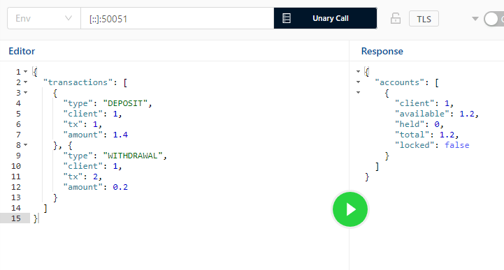

# Normal run 
Run with
```
cargo run -- <IN> > <OUT>
```
If the return code is 0, then output file should contain a valid CSV.

# Error handling
Errors are just printed to stderr.

There are two sources of error:
* from Serialization/Deserialization, for which a serde's or io's error would be printed
* from the `Processor` itself, for which an `Error` enum is just debug-printed.

# Data type for the amount
I've used the `rust_decimal` [crate](https://docs.rs/rust_decimal/latest/rust_decimal/). It should have 100% precision for four decimal places.

There is a test for it in `processor::tests::decimation`.

# Tests
Integrational tests are in `main.rs` file. 

Unit testing (without CSV processing) is also possible, but only a simple deposit-withdraw and decimation tests are provided in `processor.rs` due to the time limit.

# As library
The `Proccessor` module is written like a library. It can be used with a different parser or data streams. It does not require for the entire input data loaded into memory.

Example:
```rust
use processor::{Error, Operation, Processor, Transaction};
type ClientId = u16;

fn main() {
    let mut processor: Processor<ClientId> = Default::default();
    let good: Transaction<ClientId> = Transaction {
        r#type: Operation::Deposit,
        client: 1,
        tx: 1,
        amount: 100.0,
    };

    assert_eq!(Ok(()), processor.process(good));
}
```

<s>Trait `FromIterator<Item = Transaction>` can be easily implemented with this approach.</s>
`<I: IntoIterator<Item = Transaction<K>>>` implemented:

Deserialisation from CSV or any other source is now more idiomatic:
```rust
let iter = rdr.deserialize().filter_map(|r| r.ok());
let processor = Processor::from_iter(iter);
```

# As microservice
With the help of tonic, a `Processor` can be run as a gRPC service with:
```
cargo run --bin transactor_grpc
```

`processor.proto` contains the interface that almost match the CSV format.


